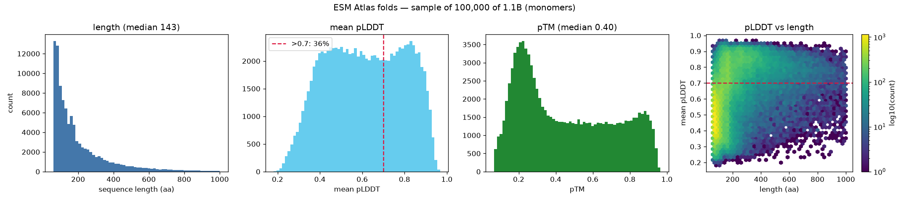
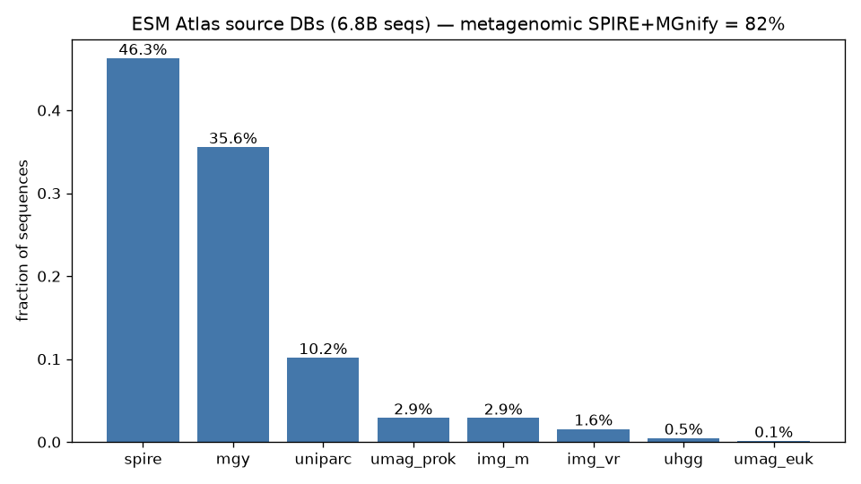
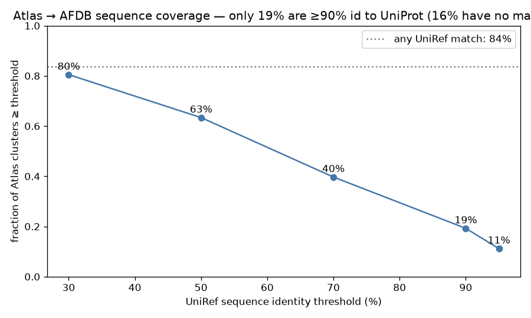
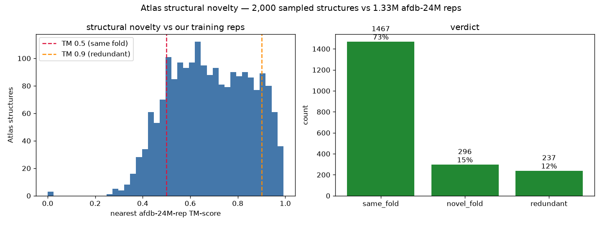
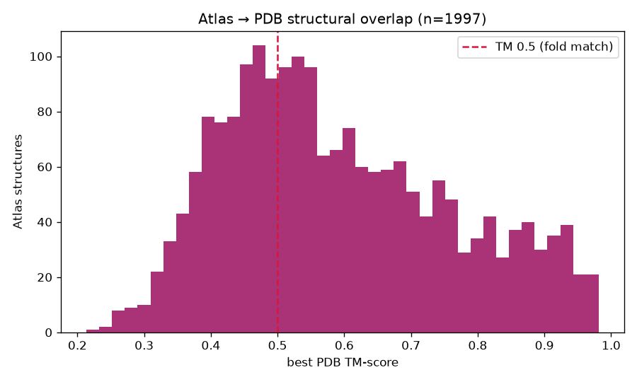
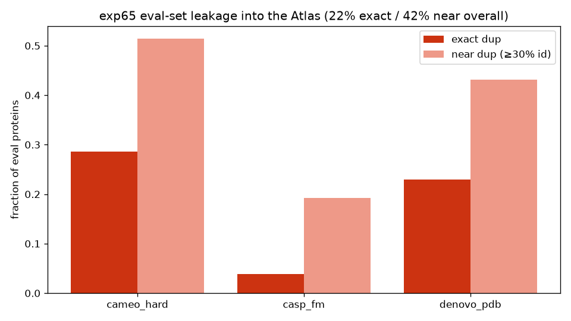

---
marinfold_experiment:
  issue: 91
  title: "exp: evaluate the ESMFold2 / ESM Atlas for training-set expansion"
  kind: evals
  branch: exp/91-evals-esmfold2-atlas
---

# exp91 — Evaluate the ESMFold2 / ESM Atlas for training-set expansion

**Issue:** [#91](https://github.com/Open-Athena/MarinFold/issues/91) · **Kind:** `evals` · **Branch:** `exp/91-evals-esmfold2-atlas`

## Question

Is the newly released **ESM Atlas** (the "ESMFold2 Atlas", from Biohub's
*Language Modeling Materializes a World Model of Protein Biology*, bioRxiv
[2026.06.03.729735](https://doi.org/10.64898/2026.06.03.729735)) worth folding
into MarinFold's training set, and if so, what does a diverse, quality-filtered,
leakage-checked subset look like?

Specifically (from the issue):
1. What exactly is in it — only protein monomers?
2. How many new **structural** clusters would it give us?
3. What quality / other filters should we apply?
4. Given our current eval set, is there leakage we need to consider?
5. If a diverse ~10–100 M subset looks good, publish it to HuggingFace (à la
   [`timodonnell/afdb-24M`](https://huggingface.co/datasets/timodonnell/afdb-24M))
   so we can generate training documents from it.

## Hypothesis

The Atlas is overwhelmingly metagenomic (SPIRE/MGnify dominate), so it should add
a large number of structural clusters not present in our afdb-24M training source,
most of it single-domain monomers. A meaningful fraction will be low-confidence
(mean pLDDT ≤ 0.7) and should be filtered. Direct leakage into our (PDB-derived,
low-MSA-depth) eval set should be low but is plausible via metagenomic homologs,
so the eval-set dedup must be re-run with the Atlas included before adoption.

## Background

- **Source paper / data:** ESM Atlas, AWS Open Data bucket
  `s3://esm-protein-atlas/` (us-west-2, anonymous read). Companion REST API at
  `https://biohub.ai/esm/protein/api/v1alpha1`. PDF in this dir.
- **Scope (locked with @jacob):** characterization + leakage only this pass; the
  HF-subset publish is **design-only** (documented + costed, not executed).
- **Novelty reference:** afdb-24M cluster reps via exp41's published foldseek DB
  (`hf://buckets/silterra/afdb-24M-foldseek-train-reps`) + its `query_similarity.py`.
- **Eval set:** reconstructible from
  [exp65](../exp65_evals_low_msa_depth_proteins/) (low-MSA-depth proteins:
  CAMEO-hard, CASP-FM, de-novo PDB). Its `candidate_sequences.csv` +
  `*_vs_afdb_reps_similarity.csv` are reused for the leakage probe.
- **License (verified):** the AWS Open Data registry
  ([`biohub-esm-atlas`](https://registry.opendata.aws/biohub-esm-atlas/)) licenses
  the **dataset** as **CC BY-SA 4.0** (ShareAlike); the ESMFold2 model/code is MIT;
  per-structure API PDBs carry a conflicting CC BY 4.0 REMARK. Full analysis +
  redistribution implications in [`data/license_terms.md`](data/license_terms.md)
  (see §Publish design).

### Atlas layout (ground truth, verified by anonymous listing)

| Path | What | Size / rows |
|------|------|-------------|
| `v1/folds/folds_1B.lance` | 1.1 B predicted structures (the folds) | 1,095,530,880 rows |
| `v1/folds/folds_atlas.lance` | second fold dataset (6.8 B superset / join) | — |
| `v1/clusters/data/representative_proteins.parquet` | SAE clusters ≥50 members + annotations | 684 MB, 7,723,579 rows |
| `v1/shared_indexes/provenance_{0..f}.parquet` | `(protein_hash, source, accession)` | 16 × ~10.8 GB, 6.8 B rows |
| `v1/sequences/deduplicated_{0..f}/NNNN.parquet` | 6.8 B dedup sequences | many shards |
| `v1/sae/data_shards/` | SAE features for 6.8 B proteins | — |

`folds_1B.lance` schema: `header, protein_hash, ptm:double, mean_plddt:double,
per_residue_plddt:binary, pae:binary, structure_blob:binary, sequence:large_string`.
One monomer per row.

### Key paper facts

- 6,824,676,938 dedup sequences → **1,095,527,764** representative sequences
  (length 60–1000 aa, 70% seq-id MMseqs2 Linclust) folded with
  `esmfold2-exp-2026-03` (3 loops / 22 diffusion steps).
- **418.5 M** structures at mean pLDDT > 0.7 (≈ 38% of 1.1 B).
- Exceeds AFDB by 835 M structures; **756 M proteins in clusters not covered by
  AFDB or the original ESM Atlas**.
- SAE-feature clusters (Jaccard ≥ 0.6): 230 M (≥5 members), 7.7 M (≥50 members).
  This is a *function*-space clustering, distinct from our foldseek structural clusters.

## Approach

Sampling-first; the full dataset is multi-TB and cross-cloud (AWS→GCS), so we never
bulk-copy (>10 GB cross-region needs sign-off). All reads are anonymous, streamed,
and byte-logged.

- `sample_atlas.py` — uniform Lance sample of `folds_1B.lance` (metadata cols at
  ~100 k; `structure_blob` sub-sample at ~2 k). Decodes a blob to confirm format.
- `characterize.py` + `plot.py` — length / pLDDT / pTM distributions, source-DB
  mix (provenance sample), monomer confirmation; pfam dark-matter from the rep table.
- `novelty.py` — structural sub-sample vs afdb-24M foldseek DB (exp41 tooling).
- `leakage.py` — exp65 eval sequences through the Atlas `similarity-search` API.

## Success criteria

- Sample is representative: pLDDT>0.7 fraction ≈ 0.38 (matches paper). ✓ (0.364)
- Quantified Atlas overlap with **AFDB and PDB** (sequence + structure). ✓
- A leakage verdict on the exp65 eval set with a concrete dedup instruction. ✓
- A costed, design-only publish plan with a license-verification precondition. ✓

## Results

All numbers are from a streamed sample (≈48 MB pulled total, far under any
transfer budget). Each figure has a source CSV in `data/`.

### Q1 — What's in it (monomers; quality; sources)

`data/fold_headline.csv`, `data/fold_distributions.csv`, `data/source_composition.csv`,
`plots/composition.png`, `plots/source_composition.png`.

- **Monomers only — structurally, not just by metadata.** Every one of the 2,000
  decoded structures is a single chain (`max_n_chains = 1`,
  `monomer_fraction = 1.0`). The pipeline clusters 6.8B sequences at 70% identity
  and folds **one representative per cluster** with `esmfold2-exp-2026-03`; there
  is no assembly, interface, or PAE-coupled multi-chain information anywhere in the
  release. For MarinFold this means the Atlas can extend single-chain fold coverage
  but contributes **nothing** to multimer / interface modeling.
- **Size & confidence distributions** (100k sample):

  | metric | q05 | q25 | median | q75 | q95 | mean |
  |--------|-----|-----|--------|-----|-----|------|
  | length (aa) | 66 | 90 | **143** | 251 | 563 | 202 |
  | mean pLDDT | 0.33 | 0.46 | **0.61** | 0.77 | 0.89 | 0.61 |
  | pTM | 0.14 | 0.23 | **0.40** | 0.68 | 0.89 | 0.46 |

  Length is **capped 60–1000 aa by construction** and skews short (half under 143
  aa — many small metagenomic ORFs). Confidence is low-centered: median mean-pLDDT
  is only **0.61** and **only 36.4%** clear the paper's 0.7 "high-confidence" bar
  (we measured 0.364 vs the paper's 0.382 over the full 1.1B — sample is
  representative). pTM is lower still (median 0.40) because it penalizes the
  disordered / low-information tail hard. **The majority of the Atlas is
  low-confidence single-sequence folding** — the single most important filtering
  fact (drives the Q3 pLDDT ≥ 0.7 → ~418M-survivor cut).
- **Provenance: a metagenomic dataset** (provenance shard 0, hash-uniform over
  6.8B seqs): **SPIRE 46.3% + MGnify 35.6% = 81.9% metagenomic**; the IMG/UMAG/UHGG
  tail pushes environmental sources to ~88%. **UniParc is only 10.2%** — the lone
  sequence-DB-derived slice, and the only path by which PDB/UniProt entries (hence
  eval-set leakage, Q4) enter the Atlas. This metagenomic dominance is *why* the
  Atlas is sequence-novel vs AFDB (Q2).
- **Functional dark matter** (7.72M ≥50-member SAE clusters): **26.2% (≈2.03M) are
  fully Pfam-dark** (no member carries a characterized Pfam domain), 40.1% are
  <50% characterized. The per-cluster distribution is U-shaped (median cluster 93%
  characterized) with a large fully-uncharacterized tail; naming tiers confirm it
  (only 413k tier-0 clusters vs 2.67M in the worst tier). This dark tail is novelty
  AFDB/Pfam never saw.




### Q2 — Overlap with AFDB and PDB (the headline question)

**Atlas → AFDB, sequence** (`data/afdb_uniref_coverage.csv`). AFDB folds UniProt,
so a UniRef match is a proxy for AFDB coverage. Over the 7.7M ≥50-member SAE
clusters: **16.2% have no UniProt/UniRef match at all** (sequence space AFDB does
not cover); only **19.3% are ≥90% identical** to a UniRef entry (i.e. essentially
in AFDB); 39.7% ≥70%, 63.4% ≥50%, 80.5% ≥30%. Median identity *where matched* is
68%. So most of the Atlas is, at best, a **distant homolog** of AFDB sequence
space, consistent with its metagenomic origin and the paper's "756M proteins in
clusters not covered by AFDB".

**Atlas → AFDB, structure** (`data/novelty_summary.csv`, `plots/novelty.png`).
Foldseek TM of the 2,000 decoded Atlas folds vs the 1.33M afdb-24M cluster
representatives (exp41's published DB — a fold-space representation of AFDB):
**14.8% are structurally novel** (nearest-AFDB TM < 0.5), **73.4% are same-fold**
(TM 0.5–0.9: a known topology carrying a new, often distant sequence), and only
**11.9% are redundant** (TM ≥ 0.9). Median nearest-AFDB TM = 0.68. So the Atlas's
value over AFDB is mostly **new sequences on known folds** (huge, given 81% are
sequence-novel above) plus a **~15% tail of genuinely new folds** — i.e. it adds
both dense sampling of known fold space and a meaningful set of net-new
structural clusters.

**Atlas → PDB, structure** (`data/atlas_vs_pdb_summary.csv`, `plots/atlas_vs_pdb.png`).
Foldseek TM of the sample vs Foldseek's prebuilt PDB database (~800k chains):
**64.5% have a PDB fold match** (best TM ≥ 0.5) but at **median 4.5% sequence
identity** — structurally PDB-like, sequence-wise unrelated (remote homologs);
only **6.4% are near-identical** to a PDB structure (TM ≥ 0.9), and **~35% have no
PDB fold match at all** (structurally novel vs the entire PDB). Median best-PDB
TM = 0.56. The PDB is much smaller than AFDB, so more of the Atlas is novel
against it (35% vs 15%).

**Dark matter** (`data/pfam_characterization.csv`, `plots/pfam_darkmatter.png`):
26.2% (2,025,330) of the 7.7M big SAE clusters carry no characterized Pfam domain;
40.1% are <50% characterized. Matches the paper's ">2M" dark clusters.





### Q3 — Recommended quality filters

The filter is implemented as a tunable funnel (`funnel.py`), designed against the
established predicted-structure distillation recipes (see **Building the distillation
subset** below). The recommended "current" set, all sequence + metadata:

- **Length 60–1000 aa** — already applied upstream; no action.
- **mean pLDDT ≥ 0.7** — the ESM team's own high-confidence bar (~38% / ~418M); the
  rest is largely low-information single-sequence folding. Don't raise it: novelty
  and confidence are anti-correlated (novel folds median pLDDT ~0.47), so a higher
  bar biases toward easy, AFDB-redundant folds.
- **pTM ≥ 0.5** — drops globally-incoherent predictions.
- **sequence identity < 40% vs our AFDB training set** (MMseqs) — the novelty axis
  that actually adds coverage. 40% is the field dedup norm (permissive; tighten later).
- **Eval-leakage dedup** — mandatory (Q4), sequence-based at ≥40%.
- *(deferred QC, on the selected reps only)* globularity (Cα contact ratio > 0.5) and
  per-residue pLDDT std — ESMFold2's structural quality screens, applied after
  selection rather than as a decode of all 1.1B.

We **drop the structural TM-dedup vs AFDB**: once a sequence is <40% identical to
AFDB, a known-fold match is "new sequence on a known fold" (AF2's same-fold bucket),
the most valuable distillation signal, not redundancy. Sample survival of this
seq+metadata funnel: ~**32% of 1.1B ≈ ~350M** before clustering (`plots/funnel.png`).

### Q4 — Eval-set leakage (secondary, but real and large)

`data/atlas_leakage.csv`, `data/atlas_leakage_summary.csv`. Each exp65 low-MSA
eval sequence checked against the Atlas by exact MD5 membership and SAE
similarity-search (top hit's identity parsed from the returned PDB).

- Of **457** eval proteins: **102 (22.3%) exact sequence duplicates** in the
  Atlas; **194 (42.5%) near-duplicates** (≥30% id / ≥50% cov; max 0.91).
- By axis: CAMEO-hard **28.6% exact / 51.4% near**, de-novo PDB 23.0% / 43.2%,
  CASP-FM (hardest) 3.8% / 19.2%.
- **Mechanism:** the Atlas ingests UniParc (which aggregates PDB), so PDB-derived
  eval proteins reappear. **Required action:** if the Atlas is adopted, re-run
  exp65's MMseqs2/Foldseek dedup with the Atlas added to the training reference
  and drop colliding proteins before any training run.



### Q5 — Publish design

See **Building the distillation subset** below for the implemented pipeline
(`funnel.py` → `selection.py`, run on EC2 via `run_aws.py`) and the materialize +
publish-to-HuggingFace step. The plan is also summarized in
[`notes/distillation_plan.md`](notes/distillation_plan.md) (the issue-ticket note).

**License (verified — `data/license_terms.md`):**

| Artifact | License | Source |
|----------|---------|--------|
| **Atlas dataset** (SAE features + 1.1B structures) | **CC BY-SA 4.0** | AWS Open Data registry [`biohub-esm-atlas`](https://registry.opendata.aws/biohub-esm-atlas/) — the canonical access point Biohub directs you to, and its stated citation source |
| ESMFold2 model + code | MIT | [`Biohub/esm`](https://github.com/Biohub/esm) `LICENSE.md` |
| Per-structure PDB (REST API) | CC BY 4.0 REMARK | API response — *conflicts* with the registry's BY-SA |

The binding constraint is **ShareAlike**: CC BY-SA 4.0 requires that any *adapted*
dataset we redistribute (decoded CIFs + contacts-v1 docs) be licensed **CC BY-SA
4.0** (or a compatible license), with attribution per the registry's "How to Cite"
string. Concretely:

- A republished HF subset **must be CC BY-SA 4.0** — more restrictive than
  `afdb-24M` (CC BY 4.0); confirm that's acceptable for our distribution goals.
- The Atlas is itself a derivative of source DBs (UniParc ~10%, SPIRE, MGnify,
  IMG, UHGG, UMAG). UniProt/UniParc is CC BY 4.0; BY → BY-SA relicensing is a
  permitted one-way direction, so Biohub's BY-SA wrapper is internally consistent,
  but our redistribution inherits BY-SA regardless.
- The **CC BY 4.0 REMARK on individual API structures contradicts the registry's
  BY-SA.** Resolve this with Biohub (support@biohub.org) before relying on the
  more-permissive reading; absent a written clarification, **treat the whole
  dataset as CC BY-SA 4.0** (the conservative, registry-stated terms).
- Training model *weights* on BY-SA data is a separate, legally-unsettled question
  from redistributing the *dataset*; the clean, well-defined obligation here is on
  the **republished subset**, which is what Q5 proposes to build.

## Building the distillation subset

Goal: add a quality-filtered, novel, de-duplicated slice of the Atlas to our
existing ~10M AFDB training set for the new structure model.

### What other models do (predicted-structure distillation survey)

Researched from the papers/supplements (memory: `distillation-recipes-survey`):

| Model | Distill source / size | Per-*structure* gate | Per-*residue* loss mask | Mix (real:distill) | Final anneal |
|-------|----------------------|----------------------|-------------------------|--------------------|--------------|
| **ESMFold2** (same team) | AFDB AF2, ~8.8M | mean pLDDT>0.7 + globularity (Cα contact>0.5) + len 200–1000 | no — picks **min pLDDT-std** rep | 30:70 | — |
| AF2 | Uniclust30, 356k | none (per-residue) | **yes** (hard mask ~pLDDT) | 25:75 | — |
| AF3 | MGnify, ~41M | GDT/PDE/clash; **dropped** pLDDT gate | no | 50:50 | yes |
| Protenix | MGnify, ~13M | best-of-5 models, no hard pLDDT | no | 60:40 | yes |
| Boltz-2 | AFDB, ~5M | global lDDT≥0.5 (loose) | no | 45:38 | yes |
| Boltz-1 / Chai-1 | OpenFold 270k / AFDB | inherited | no | 50:50 / — | yes / — |

Takeaways we adopt: gate **per structure** (not per-residue masking — AF2-only and a
training-time concern); keep **full chains** (AF3/Protenix: training on extended-loop
disorder predictions *reduces* hallucination — do not trim); **dedup at 40% identity**;
mixture 40–75% distilled; **anneal off distillation in the final fine-tune stage**
(a `models/` concern). Confidence heterogeneity is handled by **selecting the
uniformly-confident rep** (lowest per-residue pLDDT std), not by loss masking.

### Two-stage, sequence + metadata pipeline

The Atlas's `structure_blob` column is the multi-TB bulk; pLDDT/pTM are *metadata*,
and novelty/leakage/clustering are *sequence* ops — so the whole filter avoids
decoding structures until the final selected reps.

1. **`funnel.py`** — per-structure filter (tunable; defaults in Q3). Sample survival
   ~32% → ~350M. Validated on a 2k structural sample; the gate logic is a pure
   function reused verbatim by the production worker.
2. **`selection.py`** — clusters → one rep per cluster (ESMFold2 rule: longest, then
   lowest pLDDT std). Size dial = cluster identity + reps/cluster. **Clustering is our
   own MMseqs2 linclust** at 40% identity, *not* the Atlas's published SAE/Pfam
   clusters — those only cover the ≥50-member popular families (817.7M members, ~12%
   of sequences; verified) and would discard the novel singleton tail.

### Production run on AWS (`pipeline.py` + `run_aws.py`)

`pipeline.py` is the in-region worker (stages: `scan` → `merge` → `novelty` →
`leakage` → `cluster` → `select`). `run_aws.py` provisions a throwaway large-RAM EC2
instance in **us-west-2** (co-located, no egress), installs MMseqs2 + deps, runs the
funnel, uploads `selected_manifest.csv` to S3, and self-terminates.

```bash
# render the launch (no AWS calls):
python run_aws.py --dry-run \
    --s3-staging s3://<bucket>/exp91/staging \
    --s3-output  s3://<bucket>/exp91/out \
    --afdb-ref-uri s3://<bucket>/refs/afdb24m.fasta \
    --iam-instance-profile <profile-with-s3-rw> --compute-plddt-std
# add --watch (and drop --dry-run) to actually launch + poll for _DONE
```

Prerequisites (caller-provided): AWS creds, an S3 bucket in us-west-2, an IAM
instance profile with S3 read/write, and a FASTA of our AFDB training sequences for
the novelty stage. All thresholds pass through to `pipeline.py`. Smoke-test cheaply
with `--limit` (caps rows scanned) before a full run.

**Then materialize** only the selected reps: decode their `structure_blob`
(`atlas_io`, brotli→msgpack atom37) → mmCIF + a parquet matching the afdb-24M schema
→ contacts-v1 docs → publish to HuggingFace (gated on the BY-SA license question above).

## Conclusion

The ESM Atlas is a **1.1B-structure, monomer-only, ~82%-metagenomic** dataset that
would substantially expand structural coverage **beyond AFDB**: at the sequence
level only ~19% of its large clusters are ≥90%-identical to a UniRef entry and 16%
have no UniProt match at all, so the bulk is sequence space AFDB never folded;
~26% of its dense SAE clusters are Pfam-dark. It is worth pursuing as a
training-set expansion, with two hard caveats: **(1)** filter to mean pLDDT ≥ 0.7
(the other ~62% is low-information single-sequence folding), and **(2)** it leaks
into our PDB-derived eval set via UniParc (22% exact / 42% near-dup), so the
eval-set dedup must be re-run against the Atlas before training. Publishing a
filtered, dedup'd 10–100M subset is feasible but should be built AWS-side and is
gated on resolving the CC BY-SA-vs-BY license question.
